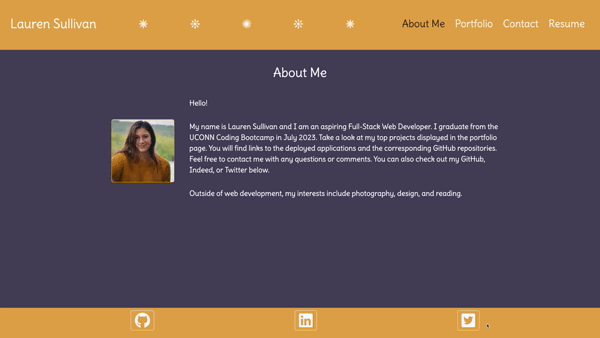

# 20-react-portfolio

## Description

This site is my current portfolio built using React.

<h3>
    <a href="https://lnsvn.github.io/20-react-portfolio/">
    Deployed Application
    </a>
</h3>

## Table of Contents

- [Visual](#visual)
- [Usage](#usage)
- [License](#license)
- [Questions](#questions)

## Visual

## Usage

When you first open the site, you are presented with the About Me page of my portfolio. There is a navigation element that changes color based on the page you are on, and there is a footer element that includes links to my GitHub, Indeed, and Twitter accounts. Both of these elements persist on every page. There are three more pages: a Porfolio page of my top projects, a Contact form page, and a Resume page that lists my proficiencies and includes a downloadable pdf of my resume. 

## License

    
## Questions

[My GitHub](https://github.com/lnsvn)

If you have further questions about this application, I can be reached by e-mail at lsullivan301@yahoo.com
